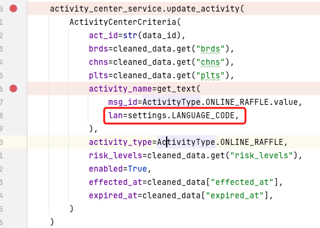

### V1.3发版复盘总结

#### 开发

1. 和PM确认PRD中的设计文档哪些是必填字段、哪些是非必填字段、默认值是什么

2. 后续开发过程中，和前端约定，如果某个输入框为空，也必须传值，如desc=None

3. 开发过程中，对于model的编写，必须指明每一个字段是否为必填，默认值是什么

   

4. 确认需求的发版日期、测试日期，按照deadline及时推进前后端开发和联调

5. 对于使用项目开发过程中，使用get_text进行翻译时，需要指定lan为settings.LANGUAGE_CODE，否则get_text会默认翻译为中文或者英文，而不是对应国家的语言

   

   默认的语言通过middleware设置

   

#### 发版前

1. 发版前，确认db-script项目是否添加好对应需求的MySQL执行脚本

   

2. 确认个人分支代码是否合到版本分支

3. 本地启动版本分支，检查是否能正常运行

4. 及时通知PM去配置中心添加对应翻译

#### 发版后

1. 发版后立即去日志平台或者对应的前端界面查看接口是否有相应的报错