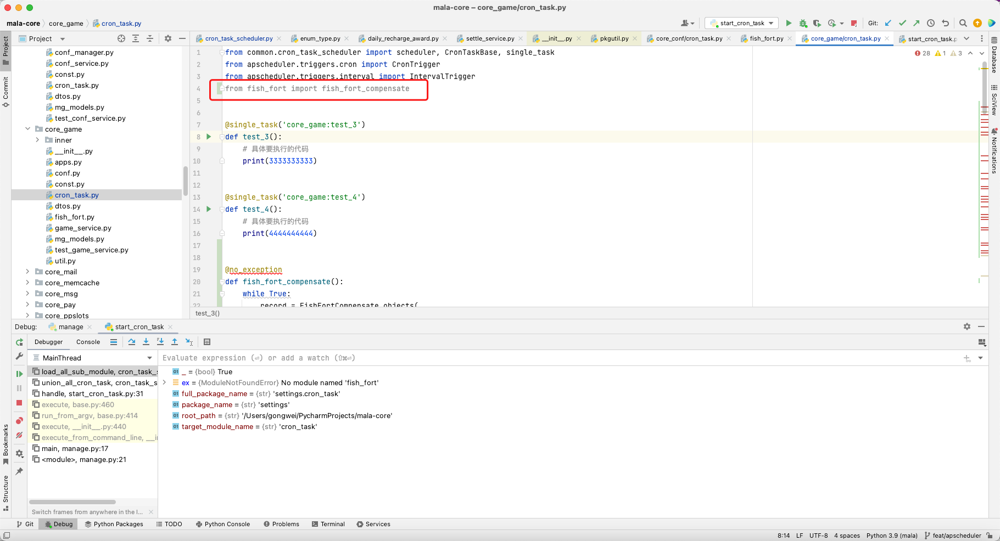
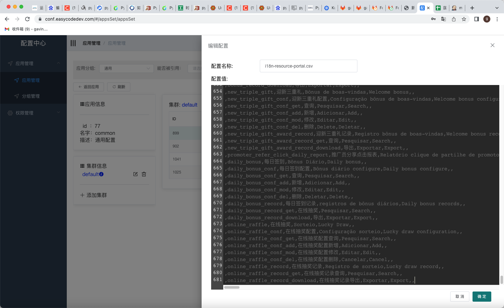
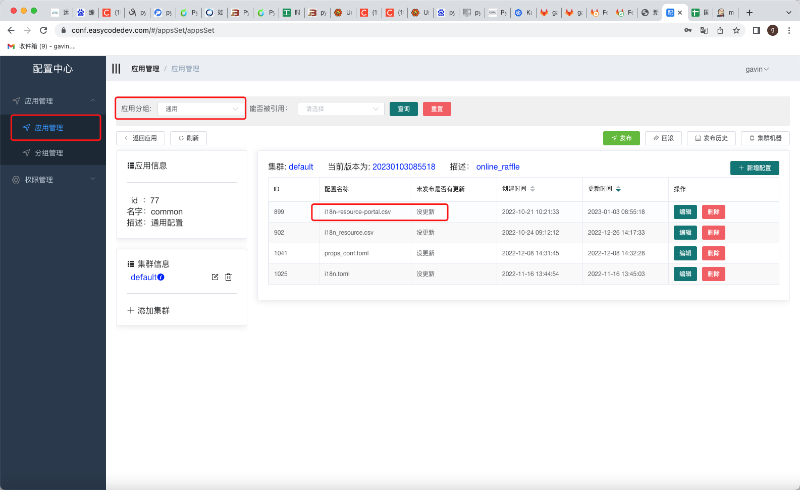

[toc]

### 一、备忘录

1. 我们用到什么很好的工具（调试：叶维鹏）可以在会议上进行分享（好像是浏览器请求打到本地服务）

2. 工具库也可以进行分享

3. 今天把有道云笔记安装上，建立工作目录

   1. 建立有用代码函数仓库，将有用的代码进行归纳总结

   2. 建立装饰器代码函数仓库

      | 装饰器名     | 装饰器含义                                                   | 装饰器位置                                                   |
      | ------------ | ------------------------------------------------------------ | ------------------------------------------------------------ |
      | no_exception | 捕获程序异常并打印日志 使用场景：出现异常后不影响程序正常向后运行 | /Users/gongwei/PycharmProjects/mala-core/core_game/fish_fort.py |
      |              |                                                              |                                                              |
      |              |                                                              |                                                              |

4. pycharm快捷生成try except

5. 相同单词同时修改

   ```
   crtl + g
   ```

6. 在core_game/core_task中添加导入，在scheduler里面不能正常导入

   

   解决办法：from .fish_fort import fish_fort_compensate

7. dubug模式下，怎么添加判断条件

8. 导出文件的文件名不规范
9. 发布测试环境online_raffle
10. 权限叫PM去翻译
11. 熟悉项目结构，比如view在哪一层，url在哪一层
12. basemager写到项目中
13. ```python
    def get_online_raffle_list_by_status(
        online_raffle_conf_list: List, status: OnlineRaffleStatus
    ) -> List:
        if status is None:
            return online_raffle_conf_list
        online_raffle_conf_list_by_status = []
        for online_raffle_conf in online_raffle_conf_list:
            from datetime import timezone
            import pytz
            a1 = pytz.timezone(settings.settings.TIME_ZONE)
            # a = timezone(settings.settings.TIME_ZONE)
            b = online_raffle_conf["effected_at"]
            c = b.astimezone(a1)
            import time
            aaa = online_raffle_conf["effected_at"]
            res = time.mktime(online_raffle_conf["effected_at"].timetuple())
            print(res)
            aaaaaa = dt.utc_to_local_str(aaa)
            bbb = time.strptime(aaaaaa, "%Y-%m-%d %H:%M:%S")
            timestamp = time.mktime(bbb)
            a22 = dt.local_to_utc(online_raffle_conf["effected_at"]).timestamp()
            b2 = dt.utc_to_local(online_raffle_conf["effected_at"]).timestamp()
            c2 = aaa.astimezone(a1)
            start_time = online_raffle_conf["effected_at"].timestamp()
            end_time = online_raffle_conf["expired_at"].timestamp()
            current_time = dt.local_now().timestamp()
            if status == OnlineRaffleStatus.WAIT:
                if current_time < start_time:
                    online_raffle_conf_list_by_status.append(online_raffle_conf)
            elif status == OnlineRaffleStatus.ONGOING:
                if start_time <= current_time < end_time:
                    online_raffle_conf_list_by_status.append(online_raffle_conf)
            elif status == OnlineRaffleStatus.DONE:
                if end_time <= current_time:
                    online_raffle_conf_list_by_status.append(online_raffle_conf)
        return online_raffle_conf_list_by_status
    
    ```

配置中心：https://conf.easycodedev.com/#/appsSet/appsSet

pt en hi



不需要重启容器

