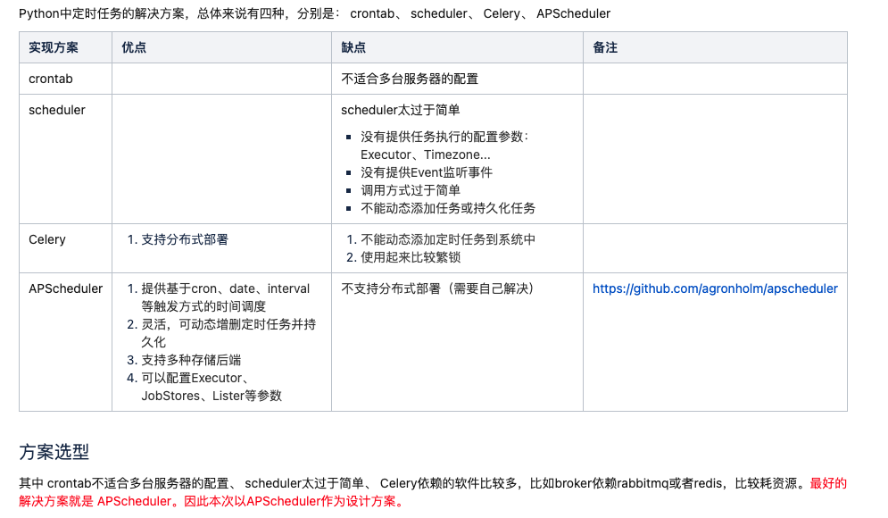

我们公司现在是用Django框架（Python语言）开发的Web项目，我们现在的定时任务实现很简单

将定时任务编写成command命令脚本，然后k8s定时跑脚本执行定时任务

我现在接手调研定时任务框架并将其引入到工程项目中

我调研了以下解决方案：

APscheduler不支持分布式锁，于是我添加了一个分布式

现在APscheduler能支持动态添加任务，也支持分布式部署了，后期只需要开发一个前端界面就能实现通过前端

但是leader不想重复造轮子，想找一个开源的定时任务框架，支持分布式部署，支持通过web界面管理定时任务，支持动态新增定时任务等功能

我现在找了

- APscheduler（支持Python）：[CronTask概要设计文档](http://doc.easycodesource.com/pages/viewpage.action?pageId=5123534)
- E-Job（支持Java）：https://shardingsphere.apache.org/elasticjob/current/cn/overview/
- AirFlow（支持Python、有管理界面、使用起来很不便）：https://airflow.apache.org/docs/apache-airflow/stable/ui.html
- xxl-job（仅支持Python脚本，当定时任务中有依赖其他模块时候运行不了、有管理界面）：[https://www.xuxueli.com/xxl-job/#%E3%80%8A%E5%88%86%E5%B8%83%E5%BC%8F%E4%BB%BB%E5%8A%A1%E8%B0%83%E5%BA%A6%E5%B9%B3%E5%8F%B0XXL-JOB%E3%80%8B](https://www.xuxueli.com/xxl-job/#《分布式任务调度平台XXL-JOB》)，找到了一个Python依赖：https://fcfangcc.github.io/pyxxl/
- Celery（支持Python、有管理界面，太笨重，也没有管理界面）：https://docs.celeryq.dev/en/stable/django/first-steps-with-django.html#using-celery-with-django
- DolpinScheduler（仅能执行简单的Python脚本，当脚本中引用其他模块时候，就运行不了）：https://dolphinscheduler.apache.org/zh-cn/

有没有推荐的开源定时任务框架（支持分布式部署，动态新增定时任务，有web管理界面的）